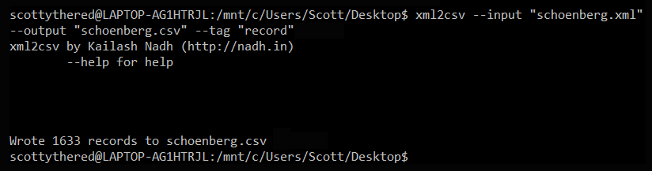
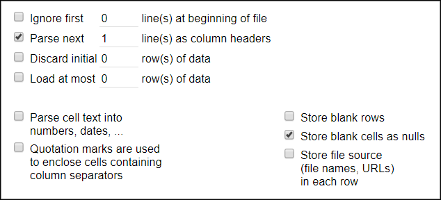

# OpenRefine, DLF Metadata QA Workshop 2017

*2:45 - 4:15 PM, led by [Scotty Carlson, Metadata Coordinator @ Fondren Library, Rice University](mailto:sjc5@rice.edu)*

## Note: this outline is still under construction. Please check back closer to the workshop for a final version.

## Goals
* Introduce the OpenRefine Interface
* Basic Data Interactions
* Program Features
* Extended Features

## What is OpenRefine?
OpenRefine (formerly Google Refine) is a powerful tool for working with messy data, including tools for cleaning, transforming from one format into another, extending with web services, and connecting to external data. (Can OpenRefine be used to create data from scratch? No. OpenRefine is really built to work with existing data, not formal data creation.)

Download links and instructions can be found [here](https://github.com/DLFMetadataAssessment/DLFMetadataQAWorkshop17/blob/master/README.md#openrefine-recommended). OpenRefine requires a working Java runtime environment, otherwise the program will not start.

Upon launch, OpenRefine will run as a local server, opening in your computer's browser. As long as OpenRefine is running, you can point your browser at either http://127.0.0.1:3333/ or http://localhost:3333/ to use it, even in several browser tabs/windows.

## Objectives
What measures that we use to assess can be found in OpenRefine work?

* Completeness: Checking to see what elements/properties/attributes are present (and how much is missing)
* Accuracy: Information is correct and factual
* Conformance to expectations: Values adhere to your expectations
* Consistency: Values are consistent within your domain, elements are represented in a consistent manner

## Importing Data

From Refine's start screen, you can create projects structured data files, continue working on past projects, and import projects that were exported out of OpenRefine. (Do not use the **Open Project** tab to create a project -- this is only for importing existing OpenRefine projects. More on that later.)

Refine can import TSV, CSV, Excel, JSON, XML, RDFXML, and Google Data documents as well as parse raw, unformatted data copied and pasted using the Clipboard function. For this session, we will use sample data from UPenn's [Schoenberg Database of Manuscripts](https://sdbm.library.upenn.edu/), which you can download [here](). Under **Create Project**, select this file to import on the home screen.

You should now see a parsing window. Here, Refine previews what your data will look like in the main interface. Refine has automatically skipped the first row of data and parsed them to column headers. (This can be changed, if need be.) As you change parameter, so will the preview.

We need to set a few parameters for our imported data:

* Refine does not choose a default character encoding, so set it to **UTF-8**.
* Uncheck all of the parsing options in the bottom right-hand corner except "Store blank cells as nulls."

Click **Create Project**.

## The Interface
After the data loads, you will be staring at the default Refine interface for your new project. In the upper lefthand corner, you will see your project name (which can be changed by clicking on it) next to the OpenRefine logo. (If you need to return to the starting screen, click that logo.)

Each of the columns in the data have drop-down menus (the upside down triangles). When you select an option in a particular column (e.g. to make a change to the data), it will affect all the cells in the column currently selected. (We will discuss this more below in Faceting). The column at the extreme left of the screen is the **All Data** menu. The All drop-down will let you make changes across all columns in one pass. It also manages the Star and Flag toggles -- more on that in Faceting.

### Rows vs. Records

OpenRefine has two modes of viewing data: Rows and Records. Upon project creation, the default setting is Rows mode, where each row represents a single record in the data set -- in our case, one entry in the database. In Records mode, OpenRefine can group multiple rows as belonging to the same Record. Multi-row records happen when Refine detects multiple values within the selected record or node. However, like a database, the first column needs to act as "Key" column; if the first column has empty cells, as ours does, these will be erroneously treated as part of the previous record:

To combat this, we need to move a unique record identifier to the first column of our OpenRefine Data. This will help make sure that multi-row records stay grouped according to your understanding of a record.

Let's move the ID column to the first position: from the drop-down, select **Edit column** > **Move column to the beginning**. The Records and Rows totals should now be back to 1,633.

Set the view to Records.

### Sorting

You can sort data in OpenRefine by to the drop-down menu and choosing **Sort**. Once you have sorted the data, a new 'Sort' drop-down menu will be displayed that lets you amend the existing sort (e.g., reverse the sort order), remove existing sorts, and/or make sorts permanent.

Let's sort by the ID column:

Sorts in OpenRefine are temporary -- if you remove the Sort, the data will go back to its original 'unordered' state.

### Splitting & Joining Multi-Valued Cells

Historically, tabular data often contains one value per field. But increasingly, data can have multiple values per certain fields. Refine can easily break apart this data and put it back together later when data transformation is complete. To do this, return to a column drop-down and select **Edit Cells** > **Split Multi-Valued Cells**.

Let's try this on the Provenance column. Enter a single pipe character (|) in the pop-up menu:

Whenever we're done, we can rejoin this split data by selecting **Edit Cells** > **Split Multi-Valued Cells** and choosing the appropriate delimiter.

### Facets & Filters

The core of Refine's power lies in its use of Facets and Filtering. Facets allow you to take a macro-level look at a large amount of data by counting individual pieces of column data, and listing them. Filtering can also allow you to select subsets of your data to act on, instead of changing entire columns.

#### Faceting

Facet information appears in the left hand panel in the OpenRefine interface. Refine supports a range of other types of facet. These include:

* **Text** facets simply list the complete text of each cell and how often those text values exactly appear in the column.
* **Numeric** and **Timeline** facets display graphs instead of lists of values, with controls to set a start and end range to filter the data displayed.
* **Scatterplot** facets are less commonly used ([see this tutorial for more information](http://enipedia.tudelft.nl/wiki/OpenRefine_Tutorial#Exploring_the_data_with_scatter_plots)).
* **Custom** facets offer a range of different customized facets, and also allow you write your own.

We are primarily interested in Text facets. Let's create a facet on our split-value Provenance column. Select: **Facet** > **Text facet**. A new facet should appear in the lefthand window:

Clicking on any of the entries in the facet window will change the interface to include only the record(s) featuring that facet entry. (If we had set our view to Rows, only the specific rows containing that facet entry would appear.) If you move your mouse pointer over an entry in the facet window, you can select multiple facet entries using the **Include** popup next to each entry. You can also select **Invert** at the top of the facet window to automatically select the opposite of the values you chose.

If you move your mouse pointer over an entry in the facet window, you'll also see the option to **Edit** the term comes up. By changing the text in the edit box and clicking Apply, you will automatically change all instances in the data at once.

#### Filtering

You can also apply Text Filters which looks for a particular piece of text appearing in a column. Click the drop down menu at the top of the column you want to filter and choose **Text filter**. In the facet area, a filter box will appear. Type in the text you want to use in the Filter to display only rows which contain that text in the selected column.

In our data, typing *Abbey* will limit what we see to only the 115 records who values in the Facet contain the word Abbey. If we change the view to Rows, that will limit us to see the 117 *rows* of our data that contain Abbey.

### Clustering

Clustering is Refine's method of algorithmically comparing a column's data against itself to look for inconsistencies. Refine uses two methods (Key Collision and Nearest Neighbor) with different functions to look for potential data inconsistencies.

On the Provenance facet window, close all filters or individual data selections, and click the **Clustering** button at the top right corner.

The Clusters from our dataset are mostly textual inconsistencies -- spelling, capitalization, etc. For each, you have the option of merging the values together, replacing inconsistencies with a single, consistent value. By default OpenRefine uses the most common value in the cluster as the new value, but you can select one of the other values by clicking the value itself, or you can simply type the desired value into the New Cell Value box.

Clustering can raise some interesting questions: *What is the formatting standard for this data? How should these categories be entered?*

##### Exercise
The default Cluster method, Key Collision/Fingerprint, is designed to provide as few false-positive results as possible. Other cluster functions will give you a wide range of supposed inconsistencies. Take 5 minutes to play around with the clustering results.

#### Note
>It is worth noting that clustering in OpenRefine works only at the syntactic level (the character composition of the cell value) and while very useful to spot errors, typos, and inconsistencies it's by no means enough to perform effective semantically-aware reconciliation.

For more information on the methods used to create Clusters, see [this article](https://github.com/OpenRefine/OpenRefine/wiki/Clustering-In-Depth).

### Undo/Redo & Applying Saved Actions

OpenRefine lets you undo (and redo) any number of effects you have taken upon your data the data. Undo/Redo data is stored with the Project and is saved automatically as you work, so next time you open the project, you can access your full history of steps you have carried out; this means you can always try out transformations and 'undo' them if need be.

The 'Undo' and 'Redo' options are accessed via the lefthand panel. The panel lists all the steps you've taken so far. To undo steps, simply click on the last step you want to preserve in the list and this will automatically undo all the changes made since that step. The remaining steps will continue to show in the list but greyed out, and you can reapply them by simply clicking on the last step you want to apply. However, if you 'undo' a set of steps and then start doing new transformations, the greyed out steps will disappear and you will no longer have the option to 'redo' these steps.

The way OpenRefine records your actions even allows you to take your work on one dataset and apply it to another by a simple copy-and-paste operation.
If you wish to save what you have done to be re-applied later, or to an entirely different project, you can click **Extract**. This allows you to copy any of the steps (or all of them) into JSON (Javascript Object Notation). This JSON data can be saved to separate file and used later by clicking the **Apply** button and pasting in the JSON data.

### GREL Expressions

Transformations in OpenRefine are ways of manipulating data in columns beyond facets and filters. Transformations are predominately written in *GREL*, or [General Refine Expression Language](https://github.com/OpenRefine/OpenRefine/wiki/General-Refine-Expression-Language). If you are familiar with Python commands or Excel formulas, you may see a number of similarities in GREL.

#### Common Transformations Menu

Some common transformations are accessible directly through menu options, without having to type them directly. Click on a column drop-down and select **Edit Cells** > **Common Transformations** to see them:

Behind these menu options, however, are GREL expressions that can be applied manually:

|Common Transformation | GREL expression|
|:--------------------:|:--------------:|
|Convert the value to uppercase text|`value.toUppercase()`|
|Convert the value to lowercase text|`value.toLowercase()`|
|Convert the value to titlecase text|`value.toTitlecase()`|
|Trim leading and trailing whitespace|`value.trim()`|
|Collapse consecutive whitespace|`value.replace(/\s+/,' ')`|
|Convert the value to a number|`value.toNumber()`|
|Convert the value to a date|`value.toDate()`|
|Convert the value to a string of text|`value.toString()`|

#### Writing GREL Expressions

The transform window is where we can get deep into the grooves of Refine's power by executing custom-written GREL commands. TO get here, select from a column drop-down: **Edit Cells** > **Transform...**. Upon opening, you'll notice the word `value` is logged in the command window; this variable stands in for the original value of the cells that we aim to change. (`value` is also a valid GREL expression -- make no changes.)

GREL expressions are written as a function being applied to some kind of data value. Some GREL functions require additional parameters or options to control what the function does. Underneath the command window, you can see a preview of the changes your expressions will inflict.

##### Exercise 1

Try out these GREL expressions on the Provenance column. You don't need to actually change the data, but do watch the previews on the command window and report any problems you run into!

* Change cases to uppercase and lowercase
* Replace a string of text: `value.replace('a', '@@@'))`
* You can also stack commands on top of each other: split apart strings by whitespace and then re-join them with pipes using `value.split(' ').join('|')`

##### Exercise 2

Open a transformation window on the Cat./Trans. Date column. We can guess these are probably dates, but right now, they are incohereant strings. Let's fix them!

Stack these three commands:

1. value.splitByLengths(4, 2, 2) = Splits the string into 3 chunks signifying YYYY, MM, and DD
2. .join('-') = rejoins those chunks with dashes
3. .toDate() = turns the join string into an object which Refine recognizes as a form of ISO 8601 combined date-time.

`value.splitByLengths(4, 2, 2).join('-').toDate()`

In the main Refine window, your column values should be in green, indicating they are no longer text strings.

#### GREL For New Columns
GREL transformations can also create new columns. Simply select the source column that will act as the basis for the mew and select **Edit columns** > **Add column based on this column...** from the drop-down menu. The command window will look almost the same as the Transform window. (Make sure you give your new column a name.)

### Reconciling to External Data

Reconciliation allows you to match your data against external data services to reconcile known entities. Remember when we said clustering works only at the syntactic level, and can't perform semantically-aware reconciliation? This function fills in that gap; the only trick is, it requires external data resources to support the service. (Full info on Reconciliation can be found [here](https://github.com/OpenRefine/OpenRefine/wiki/Reconciliation-Service-API).)

#### VIAF Reconciliation

Let's try out a Reconciliation example using [Jeff Chiu's](https://github.com/codeforkjeff) VIAF Reconciliation service. (Note: Jeff's original version of this reconciliation service has been superseded by a new version, which can be found [here](https://github.com/codeforkjeff/conciliator). However, since our needs are super low for this example, we can use his deprecated public server at http://refine.codefork.com/. If you plan to play around with his service on your own, use the newer version.)

1. First, let's split apart the multi-value cells for the column *Author*: **Edit Cells** > **Split Multi-Valued Cells**
2. Next, let's facet on the column: **Facet** > **Text facet**
3. In the facet, let's **Include** the following five author names: 'Aesop', 'Aristotle', 'Caesar, Julius', 'Chaucer, Geoffrey', and 'Dante Alighieri'. You should see 19 matching records/rows.
4. In the dropdown menu, select **Reconcile** > **Start Reconciling**.
5. Click **Add Standard Service** and in the dialogue that appears, enter: http://refine.codefork.com/reconcile/viaf
6. Since we know we are searching for the names of people, check the bubble next to **People** under **Reconcile each cell to an entity of one of these types**.
7. Click **Start Reconciling**.

Reconciliation can take a lot of time if you have a lot to look up. However, we only have 5 names to look up, so the service should work quickly.

Once the reconciliation has completed two Facets should be created automatically: **Author: Judgement** and **Author: best candidate's score**. Close the **best candidate's score** facet, but leave the **Judgement** facet open.

According to the Judgement facet, 12 of our values -- Aristotle, Caesar, and Dante -- matched and 7 -- Aesop and Chaucer -- did not.

Aristotle, Caesar, and Dante auto-matched because the judgement score on each search had a high enough probably that the VIAF match was correct. If we look at those values in the column, we'll see that they are now links that do indeed take us to the VIAF records for [Aristotle](https://viaf.org/viaf/7524651/), [Caesar](https://viaf.org/viaf/286265178/), and [Dante](https://viaf.org/viaf/97105654/).

Aesop's top match from VIAF is [Æsop](https://viaf.org/viaf/64013451/), which has a 60 percent (0.6) probability of being correct; the second-best match for Chaucer is, maddeningly, [Chaucer, Geoffrey](https://viaf.org/viaf/100185203/) at 100 percent probability. Aesop's non-match can be understood, but why no insta-match for Chaucer? Like a Tootsie Roll Pop, the world may never know.

In any case, these are the right records, so we will click the double checkmark icon next to them, which will match all identical cells to this same VIAF entity. In our facet, non-matches should disappear.

So we're done, right? **Nope.** All we have right now is the standard VIAF name form of the entity. This is good, but we still need to extract this name form to its own column, its identifier, or both.

On the Authors column, select **Edit column** > **Add column based on this column...**. In the transformation window, enter your GREL:

* `cell.recon.match.id` will extract the identifier for the entity; you can create the full VIAF uri by using `'https://viaf.org/viaf/' + cell.recon.match.id + '/'` instead
* if the name form is different than what was there before, you can choose `cell.recon.match.name` to extract that version

Once you have everything you need, your reconciliation data can be summarily dispatched by selecting **Reconcile** > **Actions** > **Clear reconciliation data**.

#### Other Reconciliation Services

There are a few services where you can find an OpenRefine Reconciliation option available:

##### Wikidata

A recon service for Wikidata is now standard in the latest version of OpenRefine, replacing the now-defunct Freebase service. (Google's Knowledge Graph was powered in part by Freebase; Google migrated to Wikidata in 2014.)

The Wikidata reconciler needs a specific Data Type to match with; in many cases, the reconciler will choose the correct data type for you (see below). In other cases, you may need to visit Wikidata to find the specific data type ID.

##### LC-Reconcile

Christina Harlow's [Library of Congress reconciler](https://github.com/cmh2166/lc-reconcile) is also a fab resource worth mentioning!

## Extended Features

### Cross, OpenRefine's VLOOKUP Function

Coming soon.

### Enriching with External Data Sources & APIs

Coming soon.

### Extending OpenRefine with Python/Jython Libraries

Coming soon.

### Extensions

Coming soon.

## Getting Your Data Out of OpenRefine

When your data has been cleaned to your satisfaction, you can export it to a variety of different file formats. Be sure all text filters and facet windows are closed, and that you have joined any split multi-valued data before you export! Clicking on the **Export** button in the upper right corner of the screen will display the export file formats available.

**Export Project**, on the other hand, will save a copy of your Refine project as a TAR archive that can be shared with other people and opened in other Refine installations.

### Templating

Refine's Templating function allows you to export your data in a "roll your own" fashion. As Refine's wiki states, "this is useful for formats that we don't support natively yet, or won't support." Currently, Templating is set up to generate a single JSON document of your data by default; other people have developed guides and schemas to template in other formats:

* [MODS](https://gist.github.com/sallain/7604ffb0c155294fcfaf)
* [XML](http://blogs.bl.uk/digital-scholarship/2015/12/using-open-refine-to-create-xml-records-for-wikimedia-batch-upload-tool.html)
* [YAML](https://github.com/OpenRefine/OpenRefine/wiki/Export-As-YAML)
