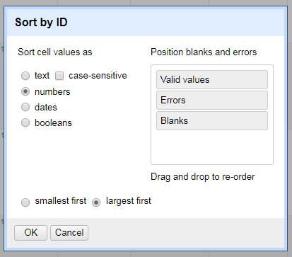

# OpenRefine, DLF Metadata QA Workshop 2017

*2:45 - 4:15 PM, led by [Scotty Carlson, Metadata Coordinator @ Fondren Library, Rice University](mailto:sjc5@rice.edu)*

## Goals of This Module:
* Basic Data Assessment
* Data Remediation
* Data Validation
* Data Enhancement

## What is OpenRefine?
OpenRefine (formerly Google Refine) is a powerful tool for working with messy data, including tools for cleaning, transforming from one format into another, extending with web services, and connecting to external data.

Can OpenRefine be used to create data from scratch? Not really. OpenRefine is built to work with existing data, although projects can be enriched with outside data.

Download links and instructions can be found [here](https://github.com/DLFMetadataAssessment/DLFMetadataQAWorkshop17/blob/master/README.md#openrefine-recommended). OpenRefine requires a working Java runtime environment, otherwise the program will not start. Upon launch, OpenRefine will run as a local server, opening in your computer's browser. As long as OpenRefine is running, you can point your browser at either http://127.0.0.1:3333/ or http://localhost:3333/ to use it, even in several browser tabs/windows.

## Module Objectives

Which of our assessment measures can be addressed with OpenRefine?

* Completeness: Checking to see what elements/properties/attributes are present (and how much of it is missing!)
* Accuracy: Information is correct and factual (to the best of our abilities)
* Conformance to expectations: Information adheres to our expectations
* Consistency: Values are consistent within our domain, elements are represented in a consistent manner

Based on these assessment measures, what assessment techniques can be applied to work in OpenRefine?

* Do the number of rows/records match up to expectations?
* Which unique elements/fields are represented in the data?
* How much of each represented element/field is empty?
* Does the data need to be converted to intelligible formatting?
* Are data values/terms used consistently? If not, what is the formatting/entry standard for this data?
* Can the data be validated externally?
* Can the data be enriched with new information?

## Table of Contents

* Importing Data
* The OR Interface
* Assessment Tools
* Data Remediation
* Validating Data
* Data Enhancement
* Getting Data Out

## Importing Data

From Refine's start screen, you can create projects from structured data files, continue working on past projects, and import projects that were exported out of OpenRefine. (Do not use the **Open Project** tab to create a project -- this is only for importing existing OpenRefine projects. More on that later.)

Refine can import TSV, CSV, Excel, JSON, and Google Data documents as well as parse raw, unformatted data copied and pasted using the Clipboard function. For this session, we will use sample data from UPenn's [Schoenberg Database of Manuscripts](https://sdbm.library.upenn.edu/), which you can download [here](https://github.com/DLFMetadataAssessment/DLFMetadataQAWorkshop17/blob/master/OR-Data/schoenberg.xml?raw=true) as an XML file; while Refine does support importing XML data, [the program suffers from a bug that can generate thousands of blank lines when importing XML](https://github.com/OpenRefine/OpenRefine/issues/1095), necessitating some upfront cleanup. Instead, I recommend converting XML data to a tabular format (CSV, TSV, etc.) before importing; the last thing we will do is export it back to an XML file.

There are lots of ways to convert XML to CSV, but we can get the job done quickly in Python with the library [**xmlutils**](https://github.com/knadh/xmlutils.py); run `pip install xmlutils` in your local shell to get it. (xmlutils works best with Python 2.7.) Once installed, we can convert our XML with the command:

`xml2csv --input "schoenberg.xml" --output "schoenberg.csv" --tag "record"`


You should now have a CSV file containing 1,633 records. Under **Create Project**, select this file to import on the home screen. (If xmlutils is giving you a hard time, find a CSV copy of the data [here](https://github.com/DLFMetadataAssessment/DLFMetadataQAWorkshop17/raw/master/OR-Data/schoenberg.csv).)

You should now see a parsing window. Here, Refine previews what your data will look like in the main interface. Refine has automatically skipped the first row of data and parsed them to column headers. (This can be changed, if need be.) As you change parameter, so will the preview. Refine does not choose a default character encoding, so make sure you set it to **UTF-8**.

Click **Create Project**.

## The OR Interface
After the data loads, you will be staring at the default Refine interface for your new project. In the upper lefthand corner, you will see your project name (which can be changed by clicking on it) next to the OpenRefine logo. (If you need to return to the starting screen, click that logo.)

Each of the columns in the data have drop-down menus (the upside down triangles). When you select an option in a particular column (e.g. to make a change to the data), it will affect all the cells in the column currently selected. (We will discuss this more below in Faceting). The column at the extreme left of the screen is the **All Data** menu. The All drop-down will let you make changes across all columns in one pass. It also manages the Star and Flag toggles -- more on that in Faceting.

### Rows vs. Records

OpenRefine has two modes of viewing data: Rows and Records. Upon project creation, the default setting is Rows mode, where each row represents a single record in the data set -- in our case, one entry in the database. In Records mode, OpenRefine can group multiple rows as belonging to the same Record. Multi-row records happen when Refine detects multiple values within the selected record or node.

Like a database, the first column needs to act as "Key" column; if the first column has empty cells, as ours does, these will be erroneously treated as part of the previous record:


To combat this, we need to move a unique record identifier to the first column of our OpenRefine Data. This will help make sure that multi-row records stay grouped according to your understanding of a record.

Let's move the ID column to the first position: from the drop-down, select **Edit column** > **Move column to the beginning**. The Records and Rows totals should now be back to 1,633.

Set the view to Records.

### Undo/Redo & Applying Saved Actions

OpenRefine lets you undo (and redo) any number of the transformations you will enact on your imported data. Your Undo/Redo history is stored with the Project and is saved automatically as you work, so the next time you open the project, you can access your full history of transformations; this means you can always try out transformations and wipe them if needed.

The 'Undo' and 'Redo' options are accessed via the lefthand panel, which lists all the steps you have undertaken. To undo, simply click on the last step you want to preserve in the list. This will automatically wipe out all the changes made after that step. The remaining steps will continue to show as greyed out; you can reapply them by simply clicking on the last step you want to apply. However, if you undo something and then apply new transformations, the greyed out steps will disappear completely, so make sure you don't need to save any of these steps before you get back to work!

This method will also allow you to take your work on one dataset and apply it to another via simple copy-paste. If you wish to save what you have done to be re-applied later, or to an entirely different project, click **Extract**. This allows you to copy any of the steps (or all of them) as JSON (Javascript Object Notation). This JSON data can be saved to separate file and used later by clicking the **Apply** button and pasting in the JSON data.

Currently, we have only one history step: moving a column. The JSON for this step looks like this:

```
[
  {
    "op": "core/column-move",
    "description": "Move column ID to position 0",
    "columnName": "ID",
    "index": 0
  }
]
```

(Notice that all of this is structured, and therefore could be automated. The transofrmation itself is idenitfied by the `op` data, the enacted column is `columnName`, and the `index` is where the column was moved; the `description` value is what we sdee in the lefthand panel. If we wanted to, we could manually sort all of our columns by copy this JSON data, making a few changes to the `description`, `columnName`, and `index` data values.)

### Sorting

You can sort data in OpenRefine by to the drop-down menu and choosing **Sort**. Once you have sorted the data, a new 'Sort' drop-down menu will be displayed that lets you amend the existing sort (e.g., reverse the sort order), remove existing sorts, and/or make sorts permanent.

Let's try it ourselves on the ID column -- the data is (mostly) already sorted from earliest ID to latest, so we will reverse this:



(Of course, it is imperative to let Refine know that we are sorting numbers and not strings of text, otherwise our sort will not be as expected.)

Note that in the furthest lefthand column, the Refine-appointed row ID numbers are still tied to their original rows. This is because sorts in OpenRefine are temporary -- if you remove the Sort, the data will go back to its original "unordered" form. You can do this by selecting **Sort** > **Remove Sort**.

## Assessment Tools

### Faceting

The core of Refine's power lies in its use of Facets and Filtering. Facets allow you to take a macro-level look at a large amount of data by counting individual pieces of column data, and listing them. Filtering can also allow you to select subsets of your data to act on, instead of changing entire columns.

Facet information appears in the left hand panel in the OpenRefine interface. Refine supports a range of other types of facet. These include:

* **Text** facets simply list the complete text of each cell and how often those text values exactly appear in the column.
* **Numeric** and **Timeline** facets display graphs instead of lists of values, with controls to set a start and end range to filter the data displayed.
* **Scatterplot** facets are less commonly used ([see this tutorial for more information](http://enipedia.tudelft.nl/wiki/OpenRefine_Tutorial#Exploring_the_data_with_scatter_plots)).
* **Custom** facets offer a range of different customized facets, and also allow you write your own.

Let's create a facet on the *Binding* column. Select: **Facet** > **Text facet**. A new facet should appear in the lefthand window.

Clicking on any of the entries in the facet window will change the interface to include only the record(s) featuring that facet entry. (If we had set our view to Rows, only the specific rows containing that facet entry would appear.) If you move your mouse pointer over an entry in the facet window, you can select multiple facet entries using the **Include** popup next to each entry. You can also select **Invert** at the top of the facet window to automatically select the opposite of the values you chose.

If you move your mouse pointer over an entry in the facet window, you'll also see the option to **Edit** the term comes up. By changing the text in the edit box and clicking Apply, you will automatically change all instances in the data at once.

In terms of assesssment, how much of each represented element/field is empty? Try creating a custom facet for empty values: **Facet** > **Customized Facets** > **Facet by Blank**

The faceted values for *True* are cells that are empty, giving us an idea of how much data is missing. (Of course, this doesn't answer WHY the data is missing.)

### Filtering

You can also apply Text Filters which looks for a particular piece of text appearing in a column. Click the drop down menu at the top of the column you want to filter and choose **Text filter**. In the facet area, a filter box will appear. Type in the text you want to use in the Filter to display only rows which contain that text in the selected column.

In our data, typing *skin* will limit what we see to only the 3 records who values in the Facet contain the word skin somewhere.

### Splitting & Joining Multi-Valued Cells

Historically, tabular data often contains one value per field. But increasingly, data can have multiple values per certain fields. Refine can easily break apart this data and put it back together later when data transformation is complete. To do this, select **Edit Cells** > **Split Multi-Valued Cells** on a column's dropdown menu.

Let's try this on the Provenance column. Enter a single pipe character (|) in the pop-up menu:


Whenever we're done, we can rejoin this split data by selecting **Edit Cells** > **Split Multi-Valued Cells** and choosing the appropriate delimiter.

## Data Remediation

### Clustering

Clustering is Refine's method of algorithmically comparing a column's data against itself to look for inconsistencies. Refine uses two methods (Key Collision and Nearest Neighbor) with different functions to look for potential data inconsistencies.

On the Provenance facet window, close all filters or individual data selections, and click the **Clustering** button at the top right corner.

The Clusters from our dataset are mostly textual inconsistencies -- spelling, capitalization, etc. For each, you have the option of merging the values together, replacing inconsistencies with a single, consistent value. By default OpenRefine uses the most common value in the cluster as the new value, but you can select one of the other values by clicking the value itself, or you can simply type the desired value into the New Cell Value box.

Clustering can raise some interesting assessment questions: ***Are data values/terms used consistently? If not, what is the formatting/entry standard for this data?***

#### Exercise
<detail>

The default Cluster method, Key Collision/Fingerprint, is designed to provide as few false-positive results as possible. Other cluster functions will give you a wide range of supposed inconsistencies. Take 5 minutes to play around with the clustering results.

When finsihed, re-join the values with a pipe character: **Edit Cells** > **Join Multi-Valued Cells**.

</detail>

#### Note
>It is worth noting that clustering in OpenRefine works only at the syntactic level (the character composition of the cell value) and while very useful to spot errors, typos, and inconsistencies it's by no means enough to perform effective semantically-aware reconciliation.

### GREL Expressions

Transformations in OpenRefine are ways of manipulating data in columns beyond facets and filters. Transformations are predominately written in *GREL*, or [General Refine Expression Language](https://github.com/OpenRefine/OpenRefine/wiki/General-Refine-Expression-Language). If you are familiar with Python commands or Excel formulas, you may see a number of similarities in GREL.

#### Common Transformations Menu

Some common transformations are accessible directly through menu options, without having to type them directly. Click on a column drop-down and select **Edit Cells** > **Common Transformations** to see them:


Behind these menu options, however, are GREL expressions that can be applied manually:

|Common Transformation | GREL expression|
|:--------------------:|:--------------:|
|Convert the value to uppercase text|`value.toUppercase()`|
|Convert the value to lowercase text|`value.toLowercase()`|
|Convert the value to titlecase text|`value.toTitlecase()`|
|Trim leading and trailing whitespace|`value.trim()`|
|Collapse consecutive whitespace|`value.replace(/\s+/,' ')`|
|Convert the value to a number|`value.toNumber()`|
|Convert the value to a date|`value.toDate()`|
|Convert the value to a string of text|`value.toString()`|

#### Writing GREL Expressions

The transform window is where we can get into the grooves of Refine's power by executing custom-written GREL commands. To get here, select from a column drop-down: **Edit Cells** > **Transform...**. Upon opening, you'll notice the word `value` is logged in the command window; this variable stands in for the original value of the cells that we aim to change. (`value` is also a valid GREL expression -- make no changes.)

GREL expressions are written as a function being applied to some kind of data value. Some GREL functions require additional parameters or options to control what the function does. Underneath the command window, you can see a preview of the changes your expressions will inflict.


GREL transformations can also create new columns. Simply select the source column that will act as the basis for the mew and select **Edit columns** > **Add column based on this column...** from the drop-down menu. The command window will look almost the same as the Transform window. (Make sure you give your new column a name.)

Try out these GREL expressions on the Provenance column. You don't need to actually change the data, but do watch the previews on the command window and report any problems you run into!

* Change cases to uppercase and lowercase
* Replace a string of text: `value.replace('a', '@@@'))`
* You can also stack commands on top of each other: split apart strings by whitespace and then re-join them with pipes using `value.split(' ').join('|')`

#### Exercise 1: Converting to Intelligible Data

<details>

Open a transformation window on the *CatOrTranslateDate* column. We can guess these are probably dates, but right now, they are incoherent strings. Let's fix them!

Stack these three commands:

1. value.splitByLengths(4, 2, 2) = Splits the string into 3 chunks signifying YYYY, MM, and DD
2. .join('-') = rejoins those chunks with dashes
3. .toDate() = turns the join string into an object which Refine recognizes as a form of ISO 8601 combined date-time.

`value.splitByLengths(4, 2, 2).join('-').toDate()`

In the main Refine window, your column values should be in green, indicating they are no longer text strings.

</details>

#### Exercise 2: Removing Problematic Delimiters

<details>

If you split apart multi-values for the *Author* column, you may see the Records count jump from 1,633 to 1,679. This is because the dataset includes "empty" values (ie, only pipe-delimiters) within this column. In the below picture, note the successive pipes ("||||") and the values that begin with pipes ("|Bonaventure, Saint, Cardinal"):


This will cause empty rows, and by extension, a false record count. We can combat this by removing these empty values.

First, undo any split values on the Author column; then, run a filter on it. We're going to use a regular expression that looks for any values that begin with pipes, end with pipes, or has consecutive pipes:

`(^\|)|(\| \|)|(\|$)`

This should give us 32 values. The first two can be remediated by hand directly from the facet. Instead of editing the remaining ones by hand, we will open a Transform window on our filtered column, and use this GREL:

`value.replace(/^\|/, '').replace('| | |','|').replace('| |','|').replace(/\|$/, '')`

The first value of this Replace command is a RegEx that isolates the pipe character when it appears at the beginning of the string, replacing it with nothing; the two middle replacements looks for multiple pipes separated with white space; the last looks for single pipes at the ends of values.

Once the transformation is run, you should be left with 1,633 records again.

</details>

## Validating Data

***Assessment question: Can the data be validated externally?***

### Reconciliation

Reconciliation allows you to match your data against external data services to reconcile known entities. Remember when we said clustering works only at the syntactic level, and can't perform semantically-aware reconciliation? This function fills in that gap; the only trick is, it requires external data resources to support the service. (Full info on Reconciliation can be found [here](https://github.com/OpenRefine/OpenRefine/wiki/Reconciliation-Service-API).)

#### Exercise: VIAF Reconciliation

Let's try out a Reconciliation example using [Jeff Chiu's](https://github.com/codeforkjeff) VIAF Reconciliation service. (Note: Jeff's original version of this reconciliation service has been superseded by a new version, which can be found [here](https://github.com/codeforkjeff/conciliator). However, since our needs are super low for this example, we can use his deprecated public server at http://refine.codefork.com/. If you plan to play around with his service on your own, use the newer version.)

1. First, let's use our split apart *Author* column. Let's facet on the column: **Facet** > **Text facet**
2. In the facet, let's **Include** the following five author names: 'Aesop', 'Aristotle', 'Caesar, Julius', 'Chaucer, Geoffrey', and 'Dante Alighieri'. You should see 19 matching records/rows.
3. In the dropdown menu, select **Reconcile** > **Start Reconciling**.
4. Click **Add Standard Service** and in the dialogue that appears, enter: http://refine.codefork.com/reconcile/viaf
5. Since we know we are searching for the names of people, check the bubble next to **People** under **Reconcile each cell to an entity of one of these types**.
6. Click **Start Reconciling**.

Reconciliation can take a lot of time if you have a lot to look up. However, we only have 5 names to look up, so the service should work quickly.

Once the reconciliation has completed two Facets should be created automatically: **Author: Judgement** and **Author: best candidate's score**. Close the **best candidate's score** facet, but leave the **Judgement** facet open.

According to the Judgement facet, 12 of our values (Aristotle, Caesar, and Dante) matched and 7 (Aesop and Chaucer) did not.

Aristotle, Caesar, and Dante auto-matched because the judgement score on each search had a high enough probably that the VIAF match was correct. If we look at those values in the column, we'll see that they are now links that do indeed take us to the VIAF records for [Aristotle](https://viaf.org/viaf/7524651/), [Caesar](https://viaf.org/viaf/286265178/), and [Dante](https://viaf.org/viaf/97105654/).

Aesop's top match from VIAF is [Æsop](https://viaf.org/viaf/64013451/), which has a 60 percent (0.6) probability of being correct; the second-best match for Chaucer is, maddeningly, [Chaucer, Geoffrey](https://viaf.org/viaf/100185203/) at 100 percent probability. Aesop's non-match can be understood, but why no insta-match for Chaucer? Like a Tootsie Roll Pop, the world may never know.

In any case, these are the right records, so we will click the double checkmark icon next to them, which will match all identical cells to this same VIAF entity. In our facet, non-matches should disappear.

So we're done, right? **Nope.** All we have right now is the standard VIAF name form of the entity. This is good, but we still need to extract this name form to its own column, its identifier, or both.

On the Authors column, select **Edit column** > **Add column based on this column...**. In the transformation window, enter your GREL:
`'https://viaf.org/viaf/' + cell.recon.match.id + '/'`
This will not only extract the identifier for the entity, but create the full VIAF URI. Name this column **viafIDs**.

Once you have this new column, reconciliation data can be dispatched by selecting **Reconcile** > **Actions** > **Clear reconciliation data**.

## Data Enhancement

### Enriching with Web APIs

Depending on what you need or want from your data, it may be pertinent to enrich existing data from an outside source. Open web APIs are great for this, because Refine can send out such web API requests, and parse the results (especially if the response is in JSON, XML, and HTML).

What if we wanted our Schoenberg data to contain geolocational data for the auction houses that sold some of the manuscripts? That metadata could potentially fuel a discovery layer to see where most of the manuscripts were sold.

1. First, [download this Refine project](https://github.com/DLFMetadataAssessment/DLFMetadataQAWorkshop17/blob/master/OR-Data/Auction-Houses.openrefine.tar.gz?raw=true), which contains some of the addresses of auction houses found in our Schoenberg data.
2. Open a new browser tab and navigate to http://127.0.0.1:3333/, which will open a new Refine window. Click the lefthand **Import Project** tab and open *Auction-Houses.openrefine.tar.gz*. You should be looking at a previously worked on Refine project with two columns: *Company* and *Address*.
3. On the dropdown for *Address*, select **Add Column** > **Add column by fetching URLs**. Name this new column *JSON*.
4. Run this GREL expression: `"https://maps.googleapis.com/maps/api/geocode/json?address=" + escape(value,"url")`

The new column should be filled with JSON data from Google's Maps API. Now let's get the latitude and longitude coordinates for each address.

5. On the dropdown for *JSON*, select **Add Column** > **Add column based on this column**. Name this new column *Coordinates*.
6. Run this GREL expression: `value.parseJson().results[0]["geometry"]["location"]["lat"] + ',' + value.parseJson().results[0]["geometry"]["location"]["lng"]`

This new column is filled with parsed JSON data featuring the exact coordinates for each address.

### Cross, OpenRefine's VLOOKUP Function

Now that we have geo-coordinates, let's go back to our Schoenberg project and enrich the data with this new geographic information. To do this, we can use a **Cross** GREL, a command not unlike a VLOOKUP formula in Excel.

The structure of a Cross GREL expression looks like this:

`cell.cross("[Source Project]", "[Matching Column]")[0].cells["[Column Data We Want]"].value`

So, we will select **Add Column** > **Add column based on this column** on *PrimarySeller* and make a new column, *LatLng*, using this GREL expression:

`cell.cross("Auction-Houses", "Company")[0].cells["Coordinates"].value`

You should now have a new column of coordinates next to *PrimarySeller*.

## Getting Data Out of OpenRefine

When your data has been cleaned to your satisfaction, you can export it to a variety of different file formats. Be sure all text filters and facet windows are closed, and that you have joined any split multi-valued data before you export! Clicking on the **Export** button in the upper right corner of the screen will display the export file formats available. **Export Project**, on the other hand, will save a copy of your Refine project as a TAR archive that can be shared with other people and opened in other Refine installations.

Refine's **Templating** function allows you to export your data in a "roll your own" fashion. As Refine's wiki states, "this is useful for formats that we don't support natively yet, or won't support." Currently, Templating is set up to generate a single JSON document of your data by default; with a few changes, we can set up a template to get our enriched Schoenberg data back to an XML file. You'll need to fill out these spaces with the below template:

Prefix:
```
<?xml version="1.0" encoding="UTF-8"?>
<records>
[blank line break]
```

Row template:
```
   <record>
      <Duplicates>{{escape(cells["Duplicates"].value,"xml")}}</Duplicates>
      <ID>{{cells["ID"].value,"xml")}}</ID>
      <CatOrTranslateDate>{{escape(cells["CatOrTranslateDate"].value,"xml")}}</CatOrTranslateDate>
      <PrimarySeller>{{escape(cells["PrimarySeller"].value,"xml")}}</PrimarySeller>
      <LatLng>{{escape(cells["LatLng"].value,"xml")}}</LatLng>
      <SecondarySeller>{{escape(cells["SecondarySeller"].value,"xml")}}</SecondarySeller>
      <InstitutionOrCollection>{{escape(cells["InstitutionOrCollection"].value,"xml")}}</InstitutionOrCollection>
      <Buyer>{{escape(cells["Buyer"].value,"xml")}}</Buyer>
      <CatalogueID>{{escape(cells["CatalogueID"].value,"xml")}}</CatalogueID>
      <LotOrCat>{{escape(cells["LotOrCat"].value,"xml")}}</LotOrCat>
      <Price>{{escape(cells["Price"].value,"xml")}}</Price>
      <Currency>{{escape(cells["Currency"].value,"xml")}}</Currency>
      <Sold>{{escape(cells["Sold"].value,"xml")}}</Sold>
      <Source>{{escape(cells["Source"].value,"xml")}}</Source>
      <CurrentLocation>{{escape(cells["CurrentLocation"].value,"xml")}}</CurrentLocation>
      <Author>{{escape(cells["Author"].value,"xml")}}</Author>
      <AuthorVariant>{{escape(cells["AuthorVariant"].value,"xml")}}</AuthorVariant>
      <viafIDs>{{escape(cells["viafIDs"].value,"xml")}}</viafIDs>
      <Title>{{escape(cells["Title"].value,"xml")}}</Title>
      <Language>{{escape(cells["Language"].value,"xml")}}</Language>
      <Material>{{escape(cells["Material"].value,"xml")}}</Material>
      <Place>{{escape(cells["Place"].value,"xml")}}</Place>
      <LiturgicalUse>{{escape(cells["LiturgicalUse"].value,"xml")}}</LiturgicalUse>
      <Date>{{escape(cells["Date"].value,"xml")}}</Date>
      <Circa>{{escape(cells["Circa"].value,"xml")}}</Circa>
      <Artist>{{escape(cells["Artist"].value,"xml")}}</Artist>
      <Scribe>{{escape(cells["Scribe"].value,"xml")}}</Scribe>
      <Folios>{{escape(cells["Folios"].value,"xml")}}</Folios>
      <Columns>{{escape(cells["Columns"].value,"xml")}}</Columns>
      <Lines>{{escape(cells["Lines"].value,"xml")}}</Lines>
      <Height>{{escape(cells["Height"].value,"xml")}}</Height>
      <Width>{{escape(cells["Width"].value,"xml")}}</Width>
      <Binding>{{escape(cells["Binding"].value,"xml")}}</Binding>
      <Provenance>{{escape(cells["Provenance"].value,"xml")}}</Provenance>
      <Comments>{{escape(cells["Comments"].value,"xml")}}</Comments>
   </record>
```

Row separator:
```
[blank line break]
```

Suffix:
```
[blank line break]
</records>
```
