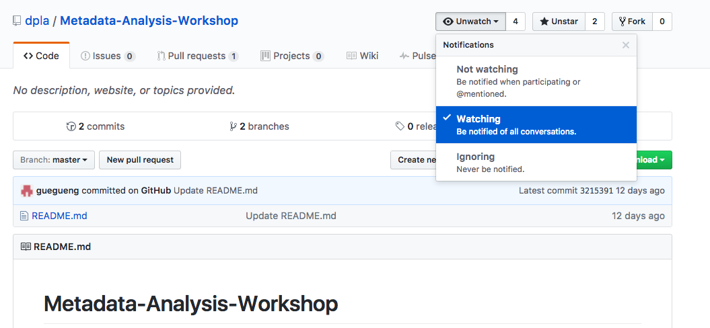
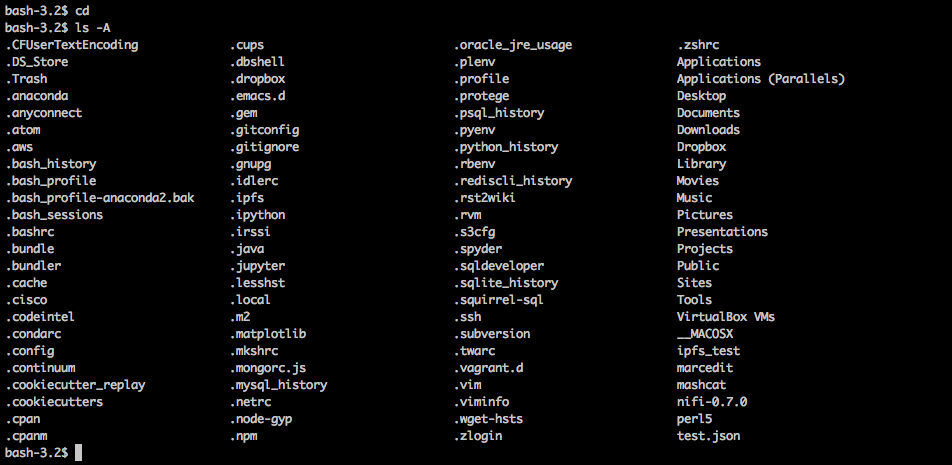
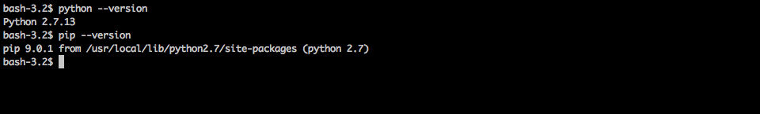
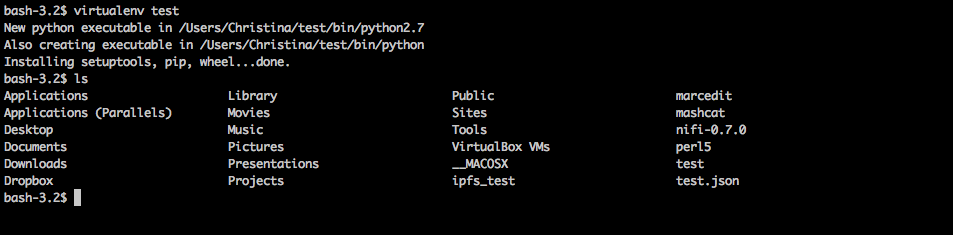
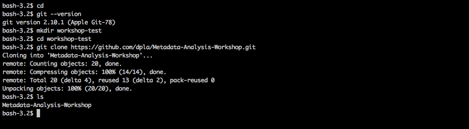
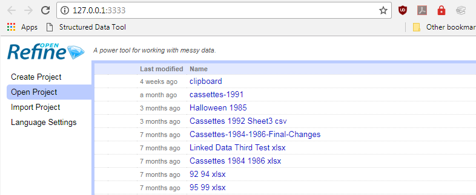

# DLF Metadata QA Workshop 2017

Welcome to the open repository, documentation and materials for the DLF Metadata QA Workshop 2017.

**Table of Contents for this Document**

- [About the Workshop](#about-the-workshop)
- [Workshop Schedule](#workshop-schedule)
- [Contact Before, During, After the Workshop](#contact-before-during-after-the-workshop)
- [Our Expectations of You](#our-expectations-of-you)
- [Participant Requirements (Installation Requests)](#participant-requirements)


## About the Workshop

This full-day metadata analysis workshop will introduce library, archive, and museum metadata practitioners and technologists with the basic skills and knowledge needed to assess metadata quality using data analysis tools. Workshop participants will be introduced to the Metadata Assessment Framework developed by the DLF Assessment Interest Group, Metadata Working Group. Using this framework as a guideline, participants will be taught the basics of using several tools to harvest, analyze, and remediate metadata, both for a local and aggregated context. The workshop will close by helping participants strategize ways to bring these tools back into their daily workflows and continue to train others they work with to do the same.

The workshop will be held **9 AM to 5 PM, Thursday, October 26, 2017 at the Westin Convention Center in room Allegheny III** and is a registration-only event. For registration information or other logistical questions before the event, please email Gretchen Gueguen, 
DPLA Data Services Coordinator and workshop organizer: [gretchen (at) dp (dot) la](mailto:gretchen@dp.la).

We ask that all participants come to the workshop ready to dive in by reviewing the information in this document. If you want a sneak peak of the workshop's contents, feel free to also watch this repository (you'll be notified of updates). To watch this repository, sign into GitHub, go this repository's home URL, and click the following button:



## Draft Workshop Schedule

Time | Lesson | Leader | Lesson Materials
-----|--------|--------|-----------------
**9-10 AM** | Intros & Welcome, Metadata Basics & MWG framework (60 minutes) | Kate & Hannah | [Slides](/slides/Intro_Basics_and_Framework.pdf)
**10-10:15 AM** | break (15 minutes) | n/a | n/a
**10:15-10:45 AM** | Specific Example of DPLA Aggregation (30 minutes) | [Gretchen](mailto:gretchen@dp.la) | [Slides](https://docs.google.com/presentation/d/1RLl0DnzHyjgQjlEDsvgGPZkI2OUYQUXxPoZEGb6f7zg/edit?usp=sharing)
**10:45-11:30 AM** | Basic Command Line & Data Harvesting Tools (30 minutes) | [Gretchen](mailto:gretchen@dp.la) | [Bash.md](Bash.md), [Metadata_Harvest.md](Metadata_Harvest.md)
**11:30 AM-1 PM** | break (90 minutes) | n/a | n/a
**1-2:30 PM** | Command Line Metadata analysis (90 minutes) | Christina | [Metadata_Breakers.md](Metadata_Breakers.md)
**2:30-2:45 PM** | break (15 minutes) | n/a | n/a
**2:45-4:15 PM** | OpenRefine (90 minutes) | Scotty | [OpenRefine.md](OpenRefine.md)
**4:15-4:45 PM** | Reuse this training (30 minutes) | [Gretchen](mailto:gretchen@dp.la) | [Slides](https://docs.google.com/presentation/d/1RLl0DnzHyjgQjlEDsvgGPZkI2OUYQUXxPoZEGb6f7zg/edit?usp=sharing)

## Contact Before, During, After the Workshop

If you have questions or concerns leading up to or after the workshop, you can get in touch in a number of ways:

- Please email Gretchen Gueguen, DPLA Data Services Coordinator and workshop organizer, particularly with logistical or registration questions: [gretchen (at) dp (dot) la](mailto:gretchen@dp.la).
- If you feel comfortable doing so, please open an issue on this GitHub repository, particularly with any questions dealing with workshop preparation or any installation issues. This allows multiple workshop leaders to respond as able, and other participants can also learn (since we're sure the same questions will come up multiple times): https://github.com/dpla/Metadata-Analysis-Workshop/issues (this will require that you login or create a free account with GitHub).
- Alternatively, you can email all the workshop leaders - [Gretchen](mailto:gretchen@dp.la), [Christina Harlow](mailto:cmharlow@gmail.com), and [Audrey Altman](mailto:audrey@dp.la) - with questions if you feel uncomfortable using GitHub issues.

During the workshop, we will indicate the best ways to get help or communicate a question/comment - however, this workshop is intended to be informal, so feel free to speak up or indicate you have a question at any time.

## Our Expectations of You

To keep this workshop a safe and inclusive space, we ask that you review and follow the [the Recurse Center Social Rules (aka Hacker School Rules)](https://www.recurse.com/manual#sub-sec-social-rules).

## Participant Requirements

We request that all participants **bring their own laptop**, preferably one you have installation or admin privileges on, to the workshop. The laptop should have the software listed below installed as well as an up-to-date modern web browser (basically, not Internet Explorer). If you have any issues with the requested set-up, please contact us ASAP using the [communication methods detailed above](#contact-before-during-after-the-workshop).

### Bash Shell (Required)
Bash is a commonly-used shell that gives you the power to do simple tasks more quickly.

Platform | Installation Instructions | Link to Installation Help
---------|---------------------------|--------------------------
Windows  | Cygwin or Git for Windows (which also installs a bash shell). | See here for installing [Cygwin](https://www.cygwin.com/cygwin-ug-net/setup-net.html), and see [here](https://git-for-windows.github.io/) for installing Git for Windows. We recommend Git for Windows if you also want to install Git (see recommendations, below)
Mac OS X | Comes pre-installed - look for Terminal (found in /Applications/Utilities) | n/a
Linux    | Comes pre-installed - The default shell is usually Bash, but if your machine is set up differently you can run it by opening a terminal and typing bash. | n/a

#### Bash Shell Install Test

Open Cygwin, Git for Windows, Terminal or your default Linux shell and test your bash install by running two simple commands (do not include the $ symbol):

```bash
$ cd
$ ls -A
```

The output should look similar (though your listed files will be different) to this:



### Python & Pip (Required)
Python is a programming language that is helpful for scripting work with data (among other uses). Pip is a package management library for Python - i.e., it installs bits of existing Python code for you easily so you can run more scripts.

We won't be learning Python in this workshop, but how to run and work with a set of existing Python scripts.

Regardless of how you choose to install it, please make sure you have **Python version 2.7.x** or greater for Python 2 (Python 3 will mostly likely not work).

Platform | Installation Instructions | Link to Installation Help
---------|---------------------------|--------------------------
Windows  | Install Python 2.7.x (which comes with Pip) by using the installer from the the Python website (the website should auto-detect your OS). | https://www.python.org/downloads/
Mac OS X | Python 2.7 & Pip is usually pre-installed on Macs OS X. If not, or you want to get a later version, download the installer for 2.7.x from the Python website (the website should auto-detect your OS). | https://www.python.org/downloads/
Linux  | Install Python 2.7.x (which comes with Pip) by using the installer from the the Python website (the website should auto-detect your OS). | https://www.python.org/downloads/

#### Python & Pip Install Test

Open Cygwin, Git for Windows, Terminal or your default Linux shell and test your Python install by running these commands (do not include the $ symbol):

```bash
$ python --version
$ pip --version
```

The output should look similar (though your versions might be slightly different) to this:



### Python Virtual Environments (Recommended)
Virtualenv (or Virtual Environments) is a Python library that allows you to create isolated environments on your computer to install packages. This protects your system Python needs from any changes in your Python experimentation, as well as having other useful aspects.

If you installed a Bash shell, Python & Pip as outlined above, you can then use Pip to install virtualenv.

Platform | Installation Instructions | Link to Installation Help
---------|---------------------------|--------------------------
Windows, Mac OS X, or Linux  | In your Bash shell: `pip install virtualenv` | https://python-guide-pt-br.readthedocs.io/en/latest/dev/virtualenvs/

#### Python VirtualEnv Install Test

Open Cygwin, Git for Windows, Terminal or your default Linux shell and test your Python VirtualEnv install by running these commands (do not include the $ symbol):

```bash
$ virtualenv test
$ ls
```

The output should look similar to this, as we've created a test Python virtualenv called 'test' and then show it's presence in our working directory:



### Git & GitHub Account (Recommended)
Git is a version control system, and GitHub is a hosting platform for Git Repositories.

These are not required, but we strongly recommend them for ease of pulling down the workshop data, scripts, & documentation.

Platform | Installation Instructions | Link to Installation Help
---------|---------------------------|--------------------------
Windows  | Download & Run the Git for Windows [installer](https://git-for-windows.github.io/). After that installation completes, follow only [step 2 forward on the GitHub setup site](https://help.github.com/articles/set-up-git/#platform-windows) to finish your Git/GitHub installation & setup. | https://git-for-windows.github.io/, https://help.github.com/articles/set-up-git/#platform-windows
Mac OS X | Install and set up Git following the directions in the link. Note - this may require you download XCode Tools first, which can be a lengthy (but not complicated) download. | https://help.github.com/articles/set-up-git/#platform-mac
Linux    | If Git is not already available on your machine you can try to install it via your distro's package manager. For Debian/Ubuntu run sudo apt-get install git and for Fedora run sudo yum install git. | https://help.github.com/articles/set-up-git/#platform-linux

#### Git & GitHub Install Test

Open Cygwin, Git for Windows, Terminal or your default Linux shell and test your Git install and GitHub setup by running these commands (do not include the $ symbol):

```bash
$ cd
$ git --version
$ mkdir workshop-test
$ cd workshop-test
$ git clone https://github.com/DLFMetadataAssessment/DLFMetadataQAWorkshop17.git
$ ls
```

The output should look similar to this. We've requested our Git version (`git --version`), then created a folder for our workshop outputs (`mkdir workshop-test`), changed (`cd workshop-test`) into that folder, cloned the Git Repository from GitHub for this workshop (`git clone ...`), then listed our files to show the presence of that clone Git repository (`ls`):



### OpenRefine (Required)
OpenRefine is a graphical-interface tool for cleaning, transforming, and enriching imported metadata. OpenRefine is strongly recommended, as it will be discussed and utilized in-depth as section five of the workshop.

The latest stable release of OpenRefine is version 2.7; an earlier iteration (version 2.5) of the tool, known as Google Refine, still works, but the workshop will use version 2.7.

Platform | Installation Instructions | Link to Installation Package
---------|---------------------------|--------------------------
Windows  | Download the ZIP package, unzip, and double-click `openrefine.exe` to start. | https://github.com/OpenRefine/OpenRefine/releases/download/2.7/openrefine-win-2.7.zip
Mac OS X | Download the DMG package, open, drag the application icon into the Applications folder, and double click it to start. | https://github.com/OpenRefine/OpenRefine/releases/download/2.7/openrefine-mac-2.7.dmg
Linux    | Download the TAR package, extract it, and run `./refine` to start. | https://github.com/OpenRefine/OpenRefine/releases/download/2.7/openrefine-linux-2.7.tar.gz

#### OpenRefine Install Test

OpenRefine requires a working Java runtime environment, otherwise the program will not start.

Upon launch, OpenRefine will run as a local server, opening your computer's browser. As long as OpenRefine is running, you can point your browser at http://127.0.0.1:3333/ to use it, even in several browser tabs/windows.



## License
All instructional materials are being made available under a [Creative Commons Attribution license] (https://creativecommons.org/licenses/by/4.0/). Feel free to reuse these materials according to these license terms.
